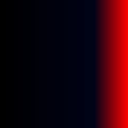
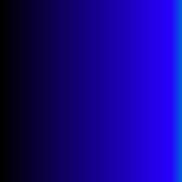
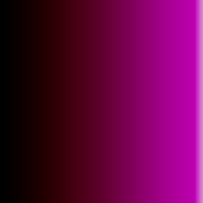
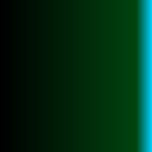
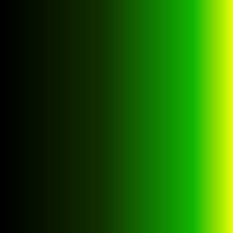
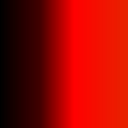
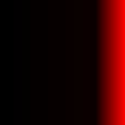
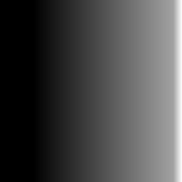
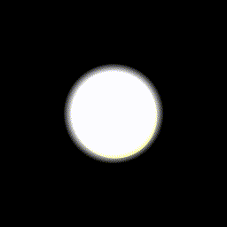

# BodhiraLightingController
This is a touchdesigner-based software to live-control the kinetic light installation "Bodhira". The Project provides a UserInterface and allows to controll lighting effects and color as well as movement states in a live setup e.g. live-music, audiovisual performances, etc.

## Contents

- [Overiview & UI](#Structure)
- [Efect- and Color Presets](#effektübersicht)
- [Controls](#controls)
- [DMX-Overview](#dmx-overwie)
- [Beitragende](#beitragende)
- [Lizenz](#lizenz)

| Ch   | Name                     | Range         | Value                       | Description                                                        | Image    |
|------|--------------------------|---------------|-----------------------------|--------------------------------------------------------------------|----------|
| 1    | Tap-Tempo                |               |                             |                                                                    |          |
|      |                          | 0             | off                         |                                                                    |          |  
|      |                          | 255           | on                          | for taping in the Tempo, controls effect and Motor Speed           |          |
| 2    | Main-Dimmer              |               |                             |                                                                    |          |
|      |                          | 0 - 255       | Dimmer-Value                | set the global brightness                                          |          |
| 3    | Color-Presets            |               |                             |                                                                    |          |
|      |                          | 0 - 14        | off                         |                                                                    |          |  
|      |                          | 15 - 42       | Color-Preset 1              | dark blue - red                                                    |  |  
|      |                          | 43 - 70       | Color-Preset 2              | blue                                                               |  |
|      |                          | 71 - 99       | Color-Preset 3              | pink                                                               |  |
|      |                          | 100 - 172     | Color-Preset 4              | green                                                              |  |
|      |                          | 128 - 155     | Color-Preset 5              | lime                                                               |  |
|      |                          | 156 - 184     | Color-Preset 6              | red - orange                                                       |  |
|      |                          | 185 - 212     | Color-Preset 7              | dark red                                                           |  |
|      |                          | 213 - 255     | Color-Preset 8              | white                                                              |  |
| 4    | Color-Shift              |               |                             |                                                                    |      |
|      |                          | 0 - 127       | negative HSV-Shift          | shift the color to a different Hue                                 |      |
|      |                          | 128           | off                         |                                                                    |      |
|      |                          | 129 - 255     | positive HSV-Shift          | shift the color to a different Hue                                 |      |
| 5    | Color-Preset FadeTime    |               |                             |                                                                    |      |
|      |                          | 0 - 255       | FadeTime - Value            | set the Time for Fading between Color-Presets                      |      |
| 6    | Overlay-Effects          |               |                             |                                                                    |      |
|      |                          | 0 - 14        | Off                         |                                                                    |      |
|      |                          | 15 - 42       | Overlay-Effect 1            | circular swoosh                                                    |  |
|      |                          | 43 - 70       | Overlay-Effect 2            | slow circular swoosh                                               |
|      |                          | 71 - 99       | Overlay-Effect 3            | noisy sparkles                                                     |
|      |                          | 100 - 172     | Overlay-Effect 4            | noisy sparkle swoosh                                               |
|      |                          | 128 - 155     | Overlay-Effect 5            | radial chaser                                                      |
|      |                          | 156 - 184     | Overlay-Effect 6            | full circle repetition                                             |
|      |                          | 185 - 212     | Overlay-Effect 7            | half circle repetition                                             |
|      |                          | 213 - 255     | Overlay-Effect 8            | strobe                                                             |
| 7    | Overlay - FadeIn Time    |               |                             |                                                                    |
|      |                          | 0 - 255       | FadeIn Time - Value         | set the Time for fading in the Overlay-Effect                      |
| 8    | Overlay - FadeOut Time   |               |                             |                                                                    |
|      |                          | 0 - 255       | FadeOut Time - Value        | set the Time for fading out the Overlay-Effect                     |
| 9    | Base-Effects             |               |                             |                                                                    |
|      |                          | 0 - 14        | off                         |                                                                    |
|      |                          | 15 - 42       | Base-Effect 1               | continuous circular movement                                       |
|      |                          | 43 - 70       | Base-Effect 2               | slow, wide circular movement                                       |
|      |                          | 71 - 99       | Base-Effect 3               | slow small circular movement                                       |
|      |                          | 100 - 172     | Base-Effect 4               | abstract circular movement 1                                       |
|      |                          | 128 - 155     | Base-Effect 5               | abstract circular movement 2                                       |
|      |                          | 156 - 184     | Base-Effect 6               | disrupted rectangular movement                                     |
|      |                          | 185 - 212     | Base-Effect 7               | slow noise movement 1                                              |
|      |                          | 213 - 255     | Base-Effect 8               | slow noise movement 2                                              |
| 10   | Base-Effect - FadeTime   |               |                             |                                                                    |
|      |                          | 0 - 255       | FadeTime - Value            | set the time for fading between Base-Effects                       |
| 11   | Motor-Power              |               |                             |                                                                    |
|      |                          | 0             | off                         | stop the Motor                                                     |
|      |                          | 255           | on                          | start the Motor                                                    |
| 12   | Motor-Gear               |               |                             |                                                                    |
|      |                          | 0             | slow                        | set the Movement to slow                                           |
|      |                          | 255           | fast                        | set the Movement to fast                                           |
| 13   | Motor-SlowDown           |               |                             |                                                                    |
|      |                          | 0             | off                         |                                                                    |
|      |                          | 255           | Slow-Down                   | temporarily slow down the Movement, good for syncing movement to beat |
| 14   | Beat-Enhancer            |               |                             |                                                                    |
|      |                          | 0 - 255       | Beat-Enhancer Intensity     | control the intensity of an automatic, beat-matched simple Dim-Effect |
| 15   | Auto-Color Shift         |               |                             |                                                                    |
|      |                          | 0 - 255       | Auto Color Shift Intensity  | control the intensity of a subtle, continuous automatic color-shift |
| 16   | Feedback                 |               |                             |                                                                    |
|      |                          | 0 - 255       | Feedback Intensity          | control the intensity of a simple Feedback Effect, good for smoothing out transitions or performative playfulness |
| 17   | AutoPilot                |               |                             |                                                                    |
|      |                          | 0             | off                         |                                                                    |
|      |                          | 255           | on                          | activate audioreactive AutoPilot. Only works if audio is injected to the System. User can still control everything. |

